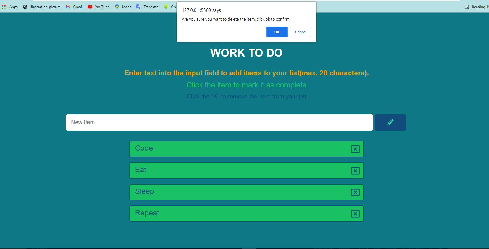
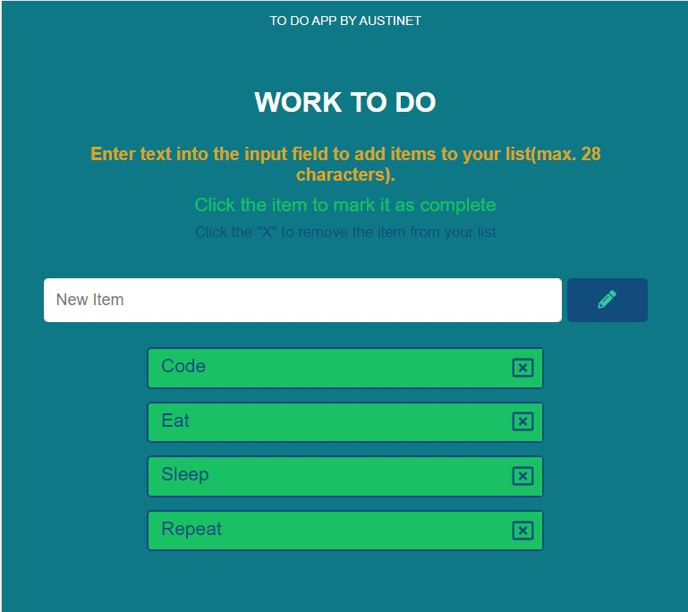
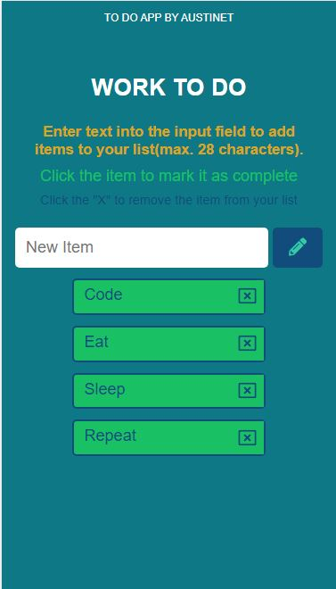

# todoapp
# Side Hustle frontend development group- To Do App Solution

## Table of contents

- [Overview](#overview)
  - [The challenge](#the-challenge)
  - [Screenshot](#screenshot)
  - [Links](#links)
- [My process](#my-process)
  - [Built with](#built-with)
  - [Continued development](#continued-development)
  - [Useful resources](#useful-resources)
- [Author](#author)
- [Acknowledgments](#acknowledgments)

## Overview

### The challenge

Users should be able to:
- View the To Do App
- View the optimal layout for the site depending on their device's screen size
- Save items to local storage, even if the user refresh, the items remain
- Delete items only if user clicks the delete button

### Screenshot

### Links

- Solution URL: [Add solution URL here](https://github.com/Austinet/todoapp.git)
- Live Site URL: [Live site](https://Austinet.github.io/todoapp/)

## My process

### Built with

- Semantic HTML5 markup
- CSS custom properties
- CSS Flexbox
- Desktop-first workflow
- Visual Studio Code
- Vanilla Javascript

### Continued development

Keep taking up projects and keep improving

### Useful resources

- [ Youtube](https://www.Youtube.com) 
- [Google  ](https://www.Google.com) 

## Author

- Frontend Mentor - [@austinet](https://www.frontendmentor.io/profile/austinet)
- Twitter - [@udhe.austine](https://www.twitter.com/udhe.austine)
- Linkedin - [Udhe Austine Ogaga](https://www.linkedin.com/in/udhe-austine-ogaga-25961820b)

## Acknowledgments

I will like to acknowledge God for giving me the grace to keep up with the good work.And also thanking my colleagues at Uncle BB and friends. And also Google, Youtube and ctrl+z lol.
